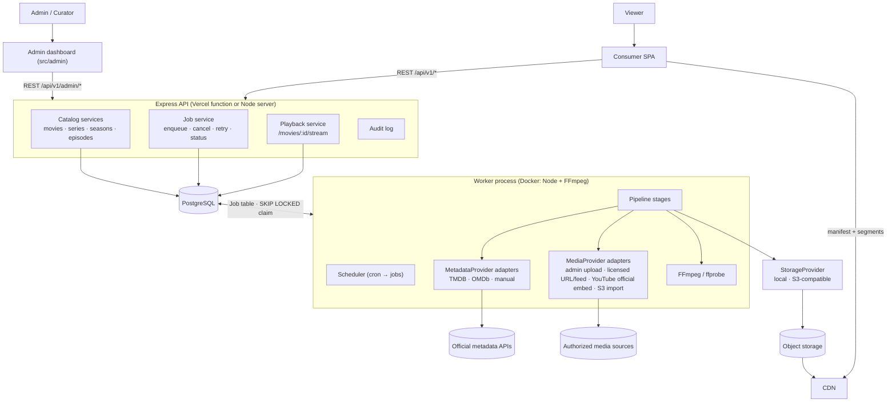
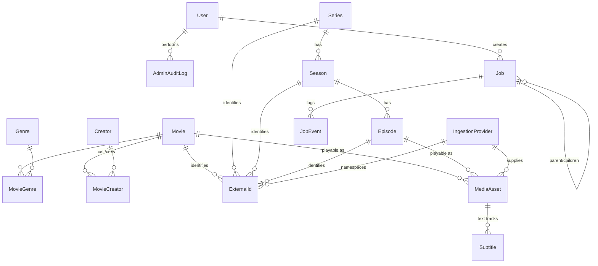

# Ocean-Movie: admin, ingestion and streaming platform plan

Status: **proposal, awaiting approval**. Nothing in this document is implemented yet.
Scope: admin management, metadata ingestion, authorized media ingestion, media processing, streaming, jobs, observability.

Legal ground rule used everywhere below: the platform only ingests, processes, stores or streams
media it is authorized to use. Metadata ingestion and media ingestion are separate pipelines. No code
path bypasses DRM, authentication, paywalls, access controls or anti-bot protection.

---

## 1. Repository audit

### Frontend

| Area | Current state |
|---|---|
| Framework | React 19 + Vite 6 + Tailwind 4, TypeScript, `motion` for animation, `lucide-react` icons |
| Routing | `react-router-dom` v7, path-based. `src/App.tsx` (829 lines) holds all consumer routes: `/`, `/movie/:slug`, `/series/:slug` (modal route), `/explore`, `/movies`, `/series`, `/shorts`, `/ai-films`, `/collections`, `/my-cinema`, `/ai-discovery`, `/profile`. `/admin/*` mounts a separate `AdminApp`. |
| State | React state + two contexts (`AuthContext`, `OceanDepthContext`). No global store, no data-fetching library. |
| API layer | `src/lib/api/client.ts`: fetch wrapper, `{ success, data, pagination }` envelope, bearer token from `localStorage`. One module per domain (`movies.api.ts`, `series.api.ts`, `aggregator.api.ts`, ...), `transformers.ts` maps API rows to UI `MediaItem`. |
| Auth | `AuthContext`: login/register/logout, token in `localStorage`, `refreshUser()`. No automatic refresh-token rotation. |
| Admin UI | `src/admin/`: own light layout with sidebar. Pages: Overview (stats), Crawl (paste / scrape page / search source), Library (edit crawled titles, remove streams). Role gate `ADMIN`/`CURATOR` client side, and enforced server side. |
| Movie detail | `MovieDetailPage.tsx` (694 lines): trailer, where-to-watch modal, "watch now" when `streamUrl` exists. |
| Player | `player/VideoPlayer.tsx`: HLS via lazily imported `hls.js` (with native Safari fallback and media/network error recovery), progressive files, iframe for embeds; progress reported in 5% steps. `MoviePlayerModal`, `SeriesPlayerModal`, `EpisodeSelector`. No quality menu, subtitle tracks, resume or next-episode autoplay. |
| Search | `AISearchModal` (Gemini-backed) and `/api/v1/search`. |
| Home / hero | `hero/*` carousel engine, `MovieRail`, `MovieRailSkeleton`. |
| Loading / error states | Skeleton rails exist. API failures fall back silently to the bundled `src/data/cinemaData.ts` (1,137 lines of placeholder data), which hides outages. |
| Frontend tests | None. |

### Backend

| Area | Current state |
|---|---|
| Framework | Express 4 "modular monolith": `routes → controllers → services → repositories`, Prisma 6, Zod validators (`validateBody/Query/Params`), `AppError` hierarchy + central `errorHandler`, `apiSuccess/apiPaginated/apiError` envelope. All under `/api/v1`. User-facing messages in Vietnamese. |
| Modules | auth, user (`/me`: profile, preferences, watchlist, progress, history, ratings), movies, series, episodes, discover, search, collections, ai (Gemini insights), aggregator. |
| Auth | JWT access (7 days) + refresh (30 days), bcrypt. `requireAuth`, `optionalAuth`, `requireRole(...)`. The role is read from the JWT, **not re-checked against the DB**. `User.role` is a free `String` (`USER`, `CURATOR`, `ADMIN` in use). |
| Aggregator | `server/aggregator/`: title normalizer (episode/season parsing, Vietnamese/CJK aware), `ingest()` with per-series transactions and unique-violation retry, HTML page scraper (regex for m3u8/video/iframe), configurable JSON/HTML search sources (`AGGREGATOR_SOURCES`), SSRF guard (`safeFetchText`: public IPs only, redirects re-validated, 15 s timeout, 5 MB cap), library/stats service, CLI. |
| Media APIs | None separate: a playable URL lives directly on `Movie.streamUrl` / `Episode.streamUrl` with `streamType` HLS/FILE/EMBED. |
| Background jobs | **None.** `POST /aggregator/scrape` scrapes up to 50 URLs synchronously inside the HTTP request. |
| Storage | None. Media is always an external URL; images are external URLs (OMDb/TMDB). |
| Cache | None (besides AI insights persisted in the DB). No `Cache-Control` on public endpoints. |
| Integrations | Gemini (`@google/genai`), OMDb + TMDB via one-off scripts in `scripts/` (not part of the app), YouTube/Vimeo/Dailymotion embed conversion (`shared/embed.ts`). |
| Tests | Vitest + Supertest: API integration (needs seeded DB), aggregator API, normalizer, pipeline, embed. 52 tests. |

### Database (PostgreSQL via Prisma)

| Concept | Model | Notes |
|---|---|---|
| Movies | `Movie` | Has `type` (MOVIE/SHORT/AI_FILM/...), `status` (release status: RELEASED/UPCOMING/IN_PRODUCTION), `isCoverFeature`, `isTrending`, stream fields, `normalizedTitle` unique. **No publish state.** |
| Series / seasons / episodes | `Series`, `Season` (unique `seriesId+seasonNumber`), `Episode` (unique `seasonId+episodeNumber`) | Good hierarchy. No publish state, no explicit ordering field besides numbers. `Episode.airDate` is a `String`. |
| Genres | `Genre`, `MovieGenre`, `SeriesGenre` | Fine. |
| People | `Creator`, `MovieCreator(role)`, `SeriesCreator(role)` | Usable for cast/directors, but no character name or billing order. AI-film fields mixed in. |
| Users | `User`, `UserPreference` | |
| Watch history / progress | `WatchHistory`, `WatchProgress` (unique per user+movie / user+episode) | Resume data already exists. |
| Favorites | `Watchlist` with `category` (WISHLIST/WATCHING/WATCHED/FAVORITE) | |
| Ratings | `Rating` | |
| Subtitles | `Subtitle` | Only language + sample text; no file/URL, format, or label. Not usable for playback. |
| Media | none | Stream URL columns on `Movie`/`Episode`. |
| Sources / providers | `Provider` + `Availability` | These are **watch providers** ("available on Netflix"), not ingestion sources. Keep them separate. |
| Crawl / import jobs | none | |
| Admin data / audit | none | |
| External IDs | none | Dedup relies on `normalizedTitle` and `slug` only. |

### Infrastructure

| Area | Current state |
|---|---|
| Deployment | Vercel: `api/index.ts` wraps the Express app as one serverless function, `vercel.json` rewrites `/api/*`. Frontend built with `vite build`. Local/other: `server.ts` long-running Express with Vite middleware in dev. |
| Database | PostgreSQL. `supabase/migrations/*.sql` hand-mirror Prisma changes; the app itself uses `prisma db push`. No Prisma migration history. |
| Docker / Compose | None. |
| Object storage / CDN | None (Vercel's CDN serves the frontend only). |
| Redis / queues | None. |
| Reverse proxy | None (Vercel edge in production). |
| CI/CD | GitHub Actions: Postgres service, `db:push` + `db:seed`, lint (`tsc`), test, build, then a deploy webhook. |
| Logging | `requestLogger`: emoji console line per request. No request ID, no structured fields. |
| Monitoring | `/api/health` (DB ping, `startedAt`). Nothing else. |
| Secrets | `.env` via dotenv + Zod-validated `env.ts`; production refuses to start without JWT secrets and `CORS_ORIGIN`. |

---

## 2. Existing architecture summary

A clean, conventional Express modular monolith with a React SPA, one Postgres database, and a
Vercel deployment. Its conventions are worth keeping as they are: layered modules, Zod at the edge,
typed errors, a response envelope, Prisma. The aggregator already has solid building blocks: the
normalizer, SSRF-safe fetching, idempotent upserts, and unique-violation retry. But it's built as
"scrape arbitrary pages synchronously and store whatever URL plays", with no job system, no media
ownership, and no publish workflow.

## 3. Current problems

1. **The sourcing model conflicts with the legal requirement.** The default is "any public host"
   (`AGGREGATOR_ALLOWED_HOSTS` empty), and the scraper stores third-party player URLs with no record
   of authorization. Most stored streams are `EMBED`s of other sites.
2. **No background jobs.** Scrapes run inside the HTTP request. On Vercel they will hit the function
   timeout, and there's no retry, progress, cancellation or history.
3. **Vercel can't host workers or FFmpeg.** Serverless functions are short-lived and have no FFmpeg,
   so a transcoding pipeline needs a separate long-running worker process.
4. **No publish state.** Anything ingested is immediately public; there is no draft/archive.
5. **Weak dedup identity.** Only `normalizedTitle`/`slug`, so no provider external IDs; "Dune" 1984
   vs 2021 collide on title.
6. **Media is a column, not an entity.** One URL per movie/episode: no multiple qualities or
   providers, no processing state, no manifest/storage location.
7. **Admin authorization trusts a 7-day JWT.** A demoted admin keeps access until expiry. No audit log.
8. **Schema drift risk.** `db push` in production plus hand-written Supabase SQL mirrors, with no
   migration history to review or roll back.
9. **No caching / CDN headers** on public catalogue endpoints. Every page view hits Postgres.
10. **Silent fallback to placeholder data** on the frontend masks API failures.
11. **Subtitles are not playable** (no file/URL), and the player lacks a quality menu, subtitles,
    resume and next-episode.
12. **Observability is console lines.** No request/job correlation IDs, no stage timings.

---

## 4. Proposed architecture

Keep the modular monolith. Add one new **worker process** built from the same codebase (same Prisma
models, services and providers), started with `pnpm worker`. The API enqueues jobs and never does
long work in a request.



Key decisions:

| Decision | Choice | Why |
|---|---|---|
| Queue | **Postgres-backed job table** claimed with `SELECT ... FOR UPDATE SKIP LOCKED` | No new infrastructure. Jobs are created in the same transaction as the rows they reference. The admin UI reads job state with ordinary queries. Throughput needs (hundreds of jobs/min) are far below Postgres limits. `pg-boss` is the fallback if we outgrow it; Redis/BullMQ only if we ever need >1k jobs/s. |
| Worker hosting | Separate long-running container (`Dockerfile.worker` with FFmpeg) | Vercel can't run it. Any container host works (Render, Fly.io, Railway, VPS). In dev it runs next to `pnpm dev`. |
| Redis | **Not introduced now** | See §10: HTTP/CDN caching gives the measurable win on Vercel. Redis gets added only when a measured need appears. |
| Streaming | **HLS (fMP4/CMAF segments)**, adaptive ladder | `hls.js` is already in the player; Safari plays HLS natively. DASH adds a second packaging path for no extra browser coverage; CMAF segments keep the option open. |
| Storage | `StorageProvider` interface: `LocalStorage` (dev) + `S3CompatibleStorage` (AWS S3, Cloudflare R2, Backblaze B2, MinIO, Supabase Storage S3 endpoint) | One adapter covers nearly every production option. |
| Realtime job progress | **Polling** (2–5 s while a job is active) | Fits the existing REST architecture. Vercel functions can't hold SSE/WebSocket connections open cheaply. |
| API namespace | New admin endpoints under `/api/v1/admin/*` | Matches the existing `/api/v1` convention. `/api/v1/aggregator/*` stays as a deprecated alias until the admin UI has moved over. |

---

## 5. Database / ERD proposal

Principles: extend existing models instead of duplicating them; reuse the repo's existing
"nullable polymorphic FK" pattern (as in `Watchlist`, `Subtitle`, `AIInsight`); no table without a
query that needs it.



### Changes to existing models

| Model | Change | Notes |
|---|---|---|
| `User` | `role` stays `String`; valid values become `USER`, `CURATOR`, `ADMIN`, `SUPER_ADMIN` (validated in code) | Avoids an enum migration on live rows. `SUPER_ADMIN` manages roles and providers; `ADMIN` does everything else; `CURATOR` edits content and runs imports but can't delete or change providers. |
| `Movie`, `Series`, `Season`, `Episode` | add `publishStatus PublishStatus @default(PUBLISHED)` (`DRAFT`/`PUBLISHED`/`ARCHIVED`), `publishedAt DateTime?` | Existing rows stay visible (default `PUBLISHED`); new imports are created as `DRAFT`. Separate from the existing release `status`. Index `(publishStatus, createdAt)`. |
| `Movie` | add `language String?`, `country String?`, `ageRating String?`, `releaseDate DateTime?` | `year` stays for existing queries. |
| `Episode` | add `airDateAt DateTime?` (keep the `airDate` string until it's backfilled), `sortOrder Int?` | Reordering doesn't require renumbering. |
| `MovieCreator`, `SeriesCreator` | add `character String?`, `billingOrder Int @default(0)` | `Creator` doubles as Person; no new Person table. |
| `Subtitle` | add `mediaAssetId String?`, `label String?`, `format String @default("vtt")`, `storageKey String?`, `url String?`, `isDefault Boolean @default(false)` | Makes subtitles playable; the existing sample fields remain. |
| `Movie.streamUrl`/`Episode.streamUrl` etc. | **kept during the transition**, backfilled into `MediaAsset`, read as a fallback, removed in a later phase | Non-breaking migration. |

### New models

```prisma
enum PublishStatus { DRAFT PUBLISHED ARCHIVED }
enum ProviderKind { METADATA MEDIA }
enum MediaAssetStatus { PENDING VALIDATING PROCESSING READY FAILED DISABLED }
enum DeliveryType { HLS DASH FILE EMBED }
enum JobStatus { QUEUED RUNNING SUCCESS FAILED CANCELLED RETRYING }

/// A metadata API or an authorized media source. Secrets stay in env vars, never in this table.
model IngestionProvider {
  id            String       @id @default(uuid())
  key           String       @unique            // "tmdb", "omdb", "admin-upload", "partner-x"
  name          String
  kind          ProviderKind
  enabled       Boolean      @default(true)
  config        Json         @default("{}")     // non-secret settings (rate limit, language, ...)
  // Authorization record for MEDIA providers: what allows us to use this content.
  licenseRef    String?                          // contract / licence id or URL
  licenseNotes  String?
  allowedHosts  String[]     @default([])        // hosts media may be fetched from
  licenseExpiresAt DateTime?
  createdAt     DateTime     @default(now())
  updatedAt     DateTime     @updatedAt
  mediaAssets   MediaAsset[]
  externalIds   ExternalId[]
}

/// Provider identity of a title: the primary dedup key.
model ExternalId {
  id          String            @id @default(uuid())
  providerId  String
  entityType  String            // MOVIE | SERIES | SEASON | EPISODE
  externalId  String
  movieId     String?
  seriesId    String?
  seasonId    String?
  episodeId   String?
  lastSyncedAt DateTime?
  provider    IngestionProvider @relation(fields: [providerId], references: [id])
  // relations to Movie/Series/Season/Episode with onDelete: Cascade
  @@unique([providerId, entityType, externalId])
  @@index([movieId]) @@index([seriesId]) @@index([seasonId]) @@index([episodeId])
}

model MediaAsset {
  id             String           @id @default(uuid())
  movieId        String?
  episodeId      String?
  providerId     String
  sourceType     String           // UPLOAD | URL | EMBED | OBJECT_STORAGE
  sourceRef      String           // original URL or storage key of the original
  status         MediaAssetStatus @default(PENDING)
  deliveryType   DeliveryType
  storagePrefix  String?          // where renditions/manifests live in object storage
  manifestKey    String?          // master.m3u8 key (HLS) — resolved to a CDN URL at read time
  playbackUrl    String?          // for EMBED/FILE assets that are not re-hosted
  durationSeconds Int?
  width          Int?
  height         Int?
  videoCodec     String?
  audioCodec     String?
  bitrateKbps    Int?
  sizeBytes      BigInt?
  checksum       String?          // sha256 of the original: detects re-imports of the same file
  renditions     Json?            // [{height, bitrateKbps, codec, playlistKey}]
  probe          Json?            // raw ffprobe summary
  isPrimary      Boolean          @default(false)
  priority       Int              @default(0)
  error          String?
  createdAt      DateTime         @default(now())
  updatedAt      DateTime         @updatedAt
  provider       IngestionProvider @relation(fields: [providerId], references: [id])
  subtitles      Subtitle[]
  @@index([movieId, status]) @@index([episodeId, status]) @@index([providerId]) @@index([status])
  @@unique([providerId, sourceRef])
}

model Job {
  id           String    @id @default(uuid())
  type         String    // IMPORT_MOVIES | IMPORT_SERIES | IMPORT_SEASON | ... (validated in code)
  status       JobStatus @default(QUEUED)
  priority     Int       @default(0)
  payload      Json
  result       Json?
  progress     Int       @default(0)        // 0..100
  processed    Int       @default(0)
  succeeded    Int       @default(0)
  skipped      Int       @default(0)
  failed       Int       @default(0)
  attempts     Int       @default(0)
  maxAttempts  Int       @default(3)
  runAt        DateTime  @default(now())     // backoff: next eligible run
  lockedAt     DateTime?
  lockedBy     String?                        // worker id; stale locks are reclaimed
  dedupeKey    String?                        // idempotency: one active job per key
  error        String?
  errorKind    String?                        // TRANSIENT | PERMANENT
  cancelRequested Boolean @default(false)
  parentId     String?
  createdById  String?
  createdAt    DateTime  @default(now())
  startedAt    DateTime?
  completedAt  DateTime?
  events       JobEvent[]
  @@index([status, runAt, priority])       // claim query
  @@index([type, status]) @@index([parentId]) @@index([createdAt])
}
-- plus a partial unique index (raw SQL migration):
-- CREATE UNIQUE INDEX job_active_dedupe ON "Job"("dedupeKey")
--   WHERE status IN ('QUEUED','RUNNING','RETRYING');

/// Stage-level log for a job: what makes every pipeline stage observable.
model JobEvent {
  id         String   @id @default(uuid())
  jobId      String
  stage      String   // DISCOVER | FETCH_METADATA | NORMALIZE | DEDUPLICATE | ...
  level      String   // info | warn | error
  message    String
  data       Json?    // {movieId, episodeId, externalId, provider, ...}
  durationMs Int?
  createdAt  DateTime @default(now())
  @@index([jobId, createdAt])
}

model AdminAuditLog {
  id           String   @id @default(uuid())
  actorId      String
  action       String   // movie.update, movie.publish, job.cancel, provider.update, user.role ...
  resourceType String
  resourceId   String?
  before       Json?
  after        Json?
  ip           String?
  userAgent    String?
  createdAt    DateTime @default(now())
  @@index([actorId, createdAt]) @@index([resourceType, resourceId]) @@index([createdAt])
}
```

Why these and not the others in the brief:

- **One `Job` table** instead of `ImportJob` + `ProcessingJob`. Both need the same lifecycle, retry and
  UI. `type` + `parentId` (an import fans out into per-title and per-asset child jobs) covers both.
- **One `ExternalId` table** for all entity levels, instead of `ExternalMovieId` + per-type tables.
- **`IngestionProvider`**, not `MediaProvider`: one registry for metadata and media sources. It doesn't
  touch the existing `Provider` (watch providers).
- **Renditions as JSON on `MediaAsset`**: always read together with the asset, never queried alone.
- **No `Person` table**: `Creator` already is one.

Search indexes: add `pg_trgm` GIN indexes on `Movie.title` and `Series.title` for admin search
(the current b-tree `@@index([title])` doesn't help `ILIKE '%q%'`).

### Migration strategy

Move from `prisma db push` to **`prisma migrate`**. First, create a baseline migration that matches the
current production schema (`prisma migrate diff --from-empty` → `migrate resolve --applied`). Every
change after that is a reviewed SQL migration. The Supabase SQL mirrors stop being hand-maintained.
All Phase 1 changes are additive (new tables, nullable or defaulted columns). Backfills run as
idempotent scripts.

---

## 6. API proposal

Existing conventions kept: `/api/v1`, `{ success, data, pagination? }` envelope, Zod validation,
`AppError` codes, Vietnamese messages.

**Authorization:** `adminRouter.use(requireAuth, requireStaff)`. `requireStaff` re-reads the role from
the DB (cached for 60 s per user), so demotion takes effect right away and a 7-day JWT stops being
enough on its own. Per-route `requireRole('ADMIN')` for destructive actions. Every mutating admin
route writes `AdminAuditLog`.

```http
# Dashboard / system
GET    /api/v1/admin/stats                    # totals, jobs, storage, popular, recent
GET    /api/v1/admin/system                   # DB, worker heartbeat, queue depth, storage reachability

# Catalogue (movies; series/seasons/episodes follow the same shape)
GET    /api/v1/admin/movies?q=&status=&genre=&year=&sort=&page=&limit=
POST   /api/v1/admin/movies
GET    /api/v1/admin/movies/:id
PATCH  /api/v1/admin/movies/:id
DELETE /api/v1/admin/movies/:id               # archive (soft); ?hard=true for SUPER_ADMIN
POST   /api/v1/admin/movies/bulk              # { ids, action: publish|unpublish|archive|refresh-metadata|feature|unfeature }
GET    /api/v1/admin/series/:id/tree          # series → seasons → episodes
POST   /api/v1/admin/series/:id/seasons
POST   /api/v1/admin/seasons/:id/episodes
PATCH  /api/v1/admin/seasons/:id/episodes/order   # [{ id, sortOrder }]
POST   /api/v1/admin/seasons/:id/publish      # cascades to episodes (optional flag)

# Media
GET    /api/v1/admin/media?status=&provider=
POST   /api/v1/admin/media                    # attach: {movieId|episodeId, providerKey, sourceType, sourceRef}
POST   /api/v1/admin/media/uploads            # presigned upload URL (S3) / multipart (local dev)
POST   /api/v1/admin/media/:id/process        # enqueue PROCESS_MEDIA
PATCH  /api/v1/admin/media/:id                # isPrimary, disable
DELETE /api/v1/admin/media/:id

# Imports & jobs
POST   /api/v1/admin/imports                  # → 202 { jobId, status: "QUEUED" }
GET    /api/v1/admin/imports                  # IMPORT_* jobs with counters
GET    /api/v1/admin/jobs?status=&type=&page=
GET    /api/v1/admin/jobs/:id                 # includes children summary
GET    /api/v1/admin/jobs/:id/events
POST   /api/v1/admin/jobs/:id/retry
POST   /api/v1/admin/jobs/:id/cancel
POST   /api/v1/admin/jobs/bulk-retry          # { ids } or { filter: { status: FAILED, type } }

# Providers, audit
GET    /api/v1/admin/providers
PATCH  /api/v1/admin/providers/:key           # SUPER_ADMIN
GET    /api/v1/admin/audit?actor=&resource=

# Public playback (replaces reading streamUrl off the title)
GET    /api/v1/movies/:id/stream              # { deliveryType, manifestUrl, renditions, subtitles, resumeSeconds }
GET    /api/v1/episodes/:id/stream            # same + { nextEpisode }
```

Public catalogue endpoints add `publishStatus = PUBLISHED` filtering. This is the one behavior
change that touches every repository, so it ships behind tests in Phase 3.

`POST /admin/imports` body (validated per provider):

```json
{ "provider": "tmdb", "kind": "movie", "filters": { "genre": "animation", "year": 2024, "language": "ja" },
  "pages": { "from": 1, "to": 5 }, "maxItems": 100, "publish": false }
```

---

## 7. Ingestion pipeline proposal

### Provider abstraction

```ts
// server/ingestion/providers/types.ts
interface MetadataProvider {
  readonly key: string;                               // "tmdb"
  discover(q: DiscoverQuery, cursor?: string): Promise<{ items: ProviderRef[]; nextCursor?: string }>;
  getMovie(externalId: string): Promise<NormalizedMovie>;
  getSeries(externalId: string): Promise<NormalizedSeries>;     // includes season list
  getSeason(seriesExternalId: string, season: number): Promise<NormalizedSeason>;
}

interface MediaProvider {
  readonly key: string;                               // "admin-upload", "partner-x", "youtube-official"
  /** Media this provider is authorized to supply for a title, if any. */
  resolve(target: MediaTarget): Promise<MediaSourceRef[]>;
  /** Stream/copy the original into our storage (or return an embed/playback URL). */
  fetch(ref: MediaSourceRef, sink: StorageWriter): Promise<FetchedMedia>;
}
```

```
server/ingestion/
  providers/
    metadata/tmdb/        # official API, attribution required
    metadata/omdb/
    metadata/manual/      # admin-entered
    media/admin-upload/   # files uploaded by staff
    media/licensed-url/   # direct HLS/MP4 from a registered provider; host must be in provider.allowedHosts
    media/youtube/        # official YouTube Data API for channel/playlist discovery; playback via official embed only
    media/s3-import/      # bucket shared by a licensor
  domain/                 # NormalizedMovie/Series/Season/Episode (+ Zod schemas)
  pipeline/               # stages below, each a pure-ish function + JobEvent logging
  jobs/                   # queue (claim/complete/fail/backoff), handlers per job type, scheduler
  media/                  # ffprobe/ffmpeg wrappers, ladder selection, HLS packaging
  storage/                # StorageProvider: local, s3
```

The core services depend only on `domain/` types, never on provider response shapes.

**What happens to the current aggregator.** The normalizer, `safeFetchText` and the idempotent upsert
logic move into `ingestion/`. The open-web HTML scraper becomes the `licensed-url` media provider:
it only fetches from hosts listed on an enabled `IngestionProvider` with a license record.
`AGGREGATOR_ALLOWED_HOSTS` "empty = any host" becomes **deny by default**. That's a deliberate
breaking change (see Risks).

### Stages

| Stage | Job type | Transient errors → retry | Permanent errors → fail, no retry |
|---|---|---|---|
| DISCOVER | `IMPORT_MOVIES` / `IMPORT_SERIES` | timeout, 429, 5xx | bad filter, provider disabled |
| FETCH METADATA | per title (child job) | same | 404 at provider |
| NORMALIZE | inline | — | schema validation failure (recorded as skipped) |
| DEDUPLICATE | inline | — | — |
| VALIDATE | inline | — | missing title/year; missing poster → warning, not failure |
| STORE METADATA | inline, one transaction per title | DB connection loss / serialization | constraint violation after retry |
| FETCH AUTHORIZED MEDIA | `PROCESS_MEDIA` | network, storage 5xx | host not authorized, 403/401 (we are **not** authorized: never retried or worked around) |
| VALIDATE MEDIA (ffprobe) | `VALIDATE_MEDIA` | — | not a video, no video stream, duration 0, over size limit |
| TRANSCODE / PACKAGE | `TRANSCODE_MEDIA` | worker killed mid-run | FFmpeg exit ≠ 0 on the same input twice |
| MANIFEST | `GENERATE_MANIFEST` | — | — |
| UPLOAD | `UPLOAD_MEDIA` | storage 5xx/timeout | credentials invalid (alert) |
| PUBLISH | `PUBLISH_MEDIA` | — | — (asset → READY; title published only if the job asked for it) |

### Deduplication order

1. `ExternalId(provider, entityType, externalId)` → exact match; update in place.
2. Another provider's external ID for the same title (e.g. TMDB result includes the IMDb ID) → link.
3. `normalizedTitle` + `year` (±1) + type → candidate.
4. Candidate plus runtime within ±5 min or matching original title → auto-merge; otherwise create
   the new title as `DRAFT` and flag it as "possible duplicate" for admin review. Never auto-merge
   on title alone.

Concurrent imports are safe: unique constraints on `ExternalId` and `normalizedTitle` + the existing
"retry once on P2002" pattern, plus `Job.dedupeKey` (e.g. `import:tmdb:movie:603`) prevents
enqueuing the same work twice.

### Job engine

- **Claim:** `UPDATE "Job" SET status='RUNNING', lockedAt=now(), lockedBy=$worker, attempts=attempts+1
  WHERE id = (SELECT id FROM "Job" WHERE status IN ('QUEUED','RETRYING') AND runAt <= now()
  ORDER BY priority DESC, runAt LIMIT 1 FOR UPDATE SKIP LOCKED) RETURNING *`.
- **Backoff:** `runAt = now() + min(2^attempts × 30 s, 1 h) ± 20% jitter`, status `RETRYING`.
- **Dead letter:** `attempts >= maxAttempts` or a permanent error → `FAILED`, with `errorKind`. The
  "Failed jobs" admin view is the dead-letter queue; retry resets `attempts`.
- **Cancellation:** sets `cancelRequested`; handlers check it between items/stages, and FFmpeg gets
  SIGTERM. Status → `CANCELLED`.
- **Stale locks:** a worker heartbeat updates `lockedAt` every 30 s; locks older than 5 min are
  reclaimed.
- **Progress:** handlers update `processed/succeeded/skipped/failed/progress` at most every 2 s.
- **Idempotency:** every handler is safe to re-run (upserts keyed by external ID; storage keys are
  deterministic, `media/{assetId}/{rendition}/...`, so re-uploads overwrite).
- **Scheduler:** cron-style definitions in code (e.g. nightly `REFRESH_METADATA` for titles synced
  > 30 days ago) that enqueue jobs with a `dedupeKey` per window.

---

## 8. Streaming architecture

```
Authorized original ─► ffprobe validate ─► ladder selection ─► FFmpeg (HLS, fMP4, 6 s segments)
   ─► master.m3u8 + per-rendition playlists + segments + poster/thumbnail sprite + VTT subtitles
   ─► StorageProvider (S3-compatible) ─► CDN ─► hls.js / Safari native
```

- **Ladder:** 360p ~800 kbps, 480p ~1.4 Mbps, 720p ~2.8 Mbps, 1080p ~5 Mbps (H.264 High, AAC 128k),
  **only rungs ≤ source height**. Keyframe every 2 s (`-g`/`-keyint_min` aligned to segment
  boundaries) so every rendition switches cleanly.
- **FFmpeg safety:** `child_process.spawn('ffmpeg', argsArray)`, never a shell string. Inputs are
  local temp files or storage keys we generated, never user-provided paths/URLs passed through.
  Time and memory limits per job, and temp dirs cleaned in `finally`.
- **Delivery:** the backend returns only playback metadata (`/movies/:id/stream`); the browser
  fetches manifests and segments straight from the CDN. The API never proxies video.
- **Caching:** segments `Cache-Control: public, max-age=31536000, immutable` (content-addressed
  by asset ID); master playlist `max-age=60`. Images through the CDN with width variants.
- **Access control (later):** signed CDN URLs/cookies if content ever needs to be restricted.
  Free/public titles don't need them.
- **Embeds:** licensed providers that only allow embedding (e.g. official YouTube uploads) stay
  `deliveryType=EMBED`, played through the provider's own player. They're not downloaded or
  re-hosted.
- **Player work (Phase 9):** quality menu (`hls.levels`, auto by default), subtitle tracks,
  resume from `WatchProgress`, next-episode countdown, season/episode selector (exists), network and
  fatal-error states with retry, progress saved every 10 s + on pause + `sendBeacon` on page
  hide (non-blocking).

**Local dev:** `LocalStorage` writes under `./storage/`, served by Express at `/media` with Range
support (dev only). Production never serves media from the API.

---

## 9. Implementation phases

Each phase ends with: what was implemented, files changed, DB changes, API changes, infra changes,
how to run, how to test, known limitations, next phase.

| # | Phase | Main deliverables | Depends on |
|---|---|---|---|
| 1 | Domain model + migrations | `prisma migrate` baseline; additive schema from §5; backfill `MediaAsset` from `streamUrl`; seed `IngestionProvider` rows; no behavior change | — |
| 2 | Admin authn/authz + audit | `/api/v1/admin` router, `requireStaff` with DB role check, `SUPER_ADMIN`, audit middleware, role-management endpoint | 1 |
| 3 | Catalogue management | Admin CRUD for movies/series/seasons/episodes, publish/archive, feature, bulk actions, public `PUBLISHED` filtering; admin pages `/admin/movies`, `/admin/series` (tree), tables with filters/pagination/confirmations/toasts | 2 |
| 4 | Metadata providers | `MetadataProvider` interface, TMDB + OMDb adapters (moved out of `scripts/`), normalization, external-ID dedup, synchronous single-title import | 1 |
| 5 | Job queue + scheduler | `Job`/`JobEvent` engine, `pnpm worker`, retry/backoff/cancel/dedupe, `POST /admin/imports` → 202, `/admin/imports` + `/admin/jobs` pages with polling progress | 4 |
| 6 | Media ingestion + validation | `MediaProvider` interface, admin upload (presigned), licensed-URL provider (deny-by-default hosts), YouTube official provider, ffprobe validation | 5, 8 (local storage enough) |
| 7 | Transcoding + HLS | FFmpeg ladder, packaging, thumbnails, `Dockerfile.worker` | 6 |
| 8 | Object storage + CDN | `StorageProvider` local + S3-compatible, CDN base URL, cache headers | 1 (can be built alongside 6) |
| 9 | Watch page | `/stream` endpoints, player quality/subtitles/resume/next-episode/error recovery | 7, 8 |
| 10 | Caching + performance | Baseline measurements, `Cache-Control`/`s-maxage` on public endpoints, targeted in-process caches, `pg_trgm` search, image variants | 3 |
| 11 | Observability | Structured JSON logger with request/job IDs, `/admin/system`, failed/running/retry views, worker heartbeat | 5 |
| 12 | Hardening | Frontend tests (Vitest + Testing Library), load test of public endpoints, security review, remove legacy `streamUrl` columns and `/aggregator` alias | all |

### Performance targets (measured before and after each optimization)

| Metric | Target | How measured |
|---|---|---|
| Public catalogue API p95 (cache miss) | < 200 ms | request logger durations |
| Public catalogue API p95 (CDN hit) | < 50 ms | Vercel analytics |
| Admin list endpoints p95 | < 400 ms at 50k titles | seeded load test |
| Slowest DB query p95 | < 50 ms | Prisma query events / `pg_stat_statements` |
| Admin page first load (LCP) | < 2.5 s on mid laptop | Lighthouse |
| Metadata import throughput | ≥ 200 titles/min (within provider rate limits) | job counters |
| Transcode throughput | ≥ 1× realtime for 1080p ladder per 4 vCPU | job durations |
| Video startup time (play → first frame) p75 | < 2 s | player timing beacon |
| Rebuffering ratio | < 1% of watch time | player beacon |
| CDN cache hit ratio (segments) | > 95% | CDN analytics |
| Job failure rate (excluding permanent source errors) | < 2% | `Job` table |

---

## 10. Caching strategy

On Vercel every function instance has its own memory, so an in-process cache has a poor hit rate.
The effective layers are:

| Target | Mechanism | Key | TTL | Invalidation | Fallback |
|---|---|---|---|---|---|
| Home rails, trending, genres, movie/series detail (public) | `Cache-Control: public, s-maxage=60, stale-while-revalidate=300` (CDN) | URL | 60 s + 5 min SWR | short TTL (admin edits visible within ~1 min) | origin query |
| Search suggestions | `s-maxage=300` | URL | 5 min | TTL | origin |
| Admin endpoints, `/me/*`, `/stream` | `Cache-Control: private, no-store` | — | — | — | — |
| Staff role check | in-process LRU | `userId` | 60 s | cleared on role change in the same instance | DB read |
| Provider metadata responses | `JobEvent`/DB (`ExternalId.lastSyncedAt`) | provider+externalId | refresh after 30 days | `REFRESH_METADATA` | refetch |

Redis becomes worthwhile only if measurements show origin load we can't handle with CDN
caching, or if we need a shared cache for personalized data. Keys would then be
`movie:{id}:v{updatedAt}` style, with deletion on admin writes.

---

## 11. Security review items

| Risk | Current | Plan |
|---|---|---|
| Admin authorization | JWT role only | DB role re-check, `SUPER_ADMIN` for role/provider changes, audit log |
| SSRF | Good guard, but DNS is resolved separately from `fetch` (rebinding window) | Pin the resolved IP via a custom `undici` dispatcher `lookup`; deny-by-default host allowlist per provider |
| Malicious URLs | Only http(s) allowed | Keep; additionally only provider-registered hosts for media |
| Uploads | none | Presigned PUT with size/content-type limits; ffprobe before anything else; storage keys generated server-side (no user filenames → no path traversal) |
| Command injection / FFmpeg args | none | `spawn` with arg arrays, fixed option set, no user strings in args |
| Rate limiting | 500 req / 15 min per IP globally; auth limiter | Stricter limiter on `/admin/imports` and upload endpoints |
| Secrets | env vars | Provider API keys and storage credentials stay server/worker-side only; presigned URLs expire in ≤ 15 min |
| CORS | allowlist | unchanged |
| CSRF | bearer tokens in `localStorage` (no cookies) → CSRF N/A; XSS exposure instead | Keep for now; consider httpOnly refresh cookie + short access token in Phase 12 |

---

## 12. Risks

| Risk | Impact | Mitigation |
|---|---|---|
| Moving from `db push` to `prisma migrate` on a live DB | A wrong baseline can make migrate want to recreate tables | Generate the baseline from the production schema with `migrate diff`, verify on a DB copy, mark it applied with `migrate resolve` |
| Public `PUBLISHED` filter | Titles disappear from the site if a query is missed or the defaults are wrong | Default `PUBLISHED` for existing rows; API tests per public endpoint |
| Deny-by-default media hosts | Existing crawl flows stop working until providers are registered | Admin UI to register providers with license info; existing stored streams keep playing (read-only fallback) |
| Worker needs separate hosting | Extra cost/ops; imports won't run on Vercel alone | One small container is enough initially; dev runs in-process via `pnpm worker` |
| Transcoding cost | CPU-heavy, large storage/egress | Ladder capped to source height, R2-style zero-egress storage, only process titles staff mark for processing |
| Provider terms | TMDB/OMDb commercial use and attribution requirements | Attribution in UI, respect rate limits, store licence info per provider |
| Scope | 12 phases is a lot | One phase per PR, each independently shippable |

---

## 13. Open decisions (needed before Phase 5–8)

1. **Worker host:** Render / Fly.io / Railway / a VPS (anything that runs a Docker container)?
2. **Object storage + CDN:** Cloudflare R2 + Cloudflare CDN (no egress fees), AWS S3 + CloudFront, or
   Supabase Storage?
3. **Authorized media sources you have today:** your own uploads, a licensor's files or feed,
   official YouTube channels? This decides which `MediaProvider`s get built first.
4. **Metadata provider:** TMDB (you already have a token) as primary, OMDb as secondary?
5. **Deny-by-default for the existing page scraper:** OK to make that breaking change in Phase 6?
